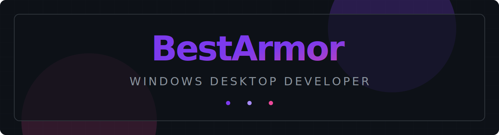

  

 

  

 

  <table border="0" cellspacing="0" cellpadding="15" width="100%">
    <tr>
      <td align="center" style="background-color: #0D1117; border: 1px solid #21262D; border-radius: 12px;">
        
      </td>
      <td align="center" style="background-color: #0D1117; border: 1px solid #21262D; border-radius: 12px;">
        
      </td>
    </tr>
  </table>

 

  <table border="0" cellspacing="15" cellpadding="0" width="100%">
    <tr>
      <td align="left" style="background-color: #0D1117; border: 1px solid #21262D; border-radius: 12px; padding: 20px;">
        <h4 style="color: #E6EDF3; margin-bottom: 5px;">⚙️ C# & .NET</h4>
        
High-performance desktop applications. Solid architecture, MVVM, and clean code.

      </td>
      <td align="left" style="background-color: #0D1117; border: 1px solid #21262D; border-radius: 12px; padding: 20px;">
        <h4 style="color: #E6EDF3; margin-bottom: 5px;">🎨 WPF & UI/UX</h4>
        
Dark themes, glassmorphism, and smooth animations via XAML. Vercel/Linear level design.

      </td>
    </tr>
  </table>

 

  
  

